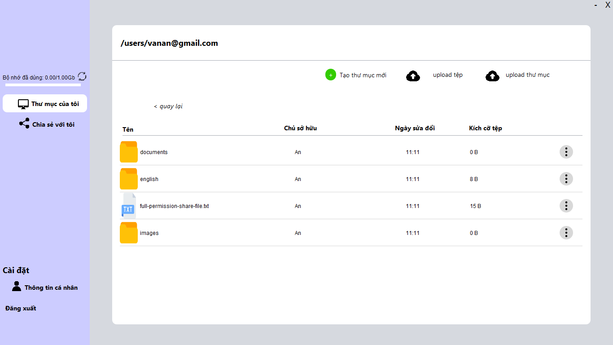
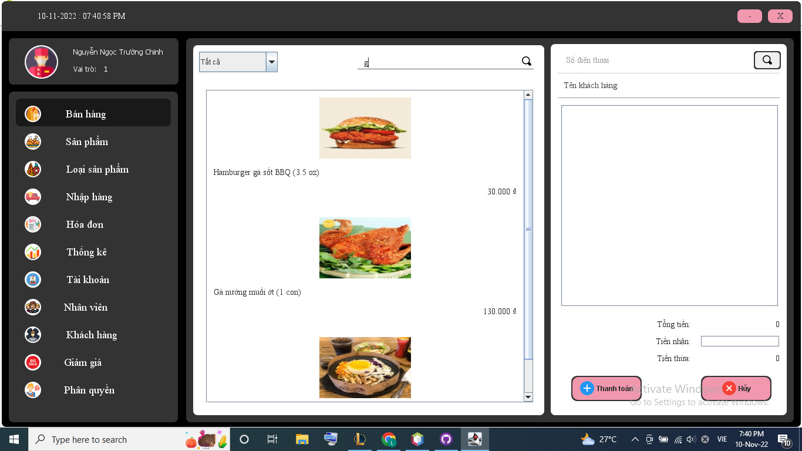

# Portfolio
---
# Skills
## Learned
Language: HTML5, CSS, JavaSript, Java core, C/C++, PHP  
Framework: Bootstrap, NodeJS; ORM,ODM: Hibernate, Morphia, Mongoose
## Learning
Language: Python  
Framework: Flask, Django, Spring boot, ReactJS; ORM, ODM: Sequelize, Django ORM

---
# Projects
## FTP Application

FTP Secure is a unique and secure solution for data transmission between client and server. Built on the Java platform and utilizing the Hibernate framework, this application not only provides a user-friendly interface but also ensures high security.

By employing Socket, the application establishes a robust connection between devices while using symmetric key encryption to safeguard data from unauthorized access. The flexible combination of asymmetric keys ensures that only authenticated partners can connect, thus mitigating security risks effectively.

Through Hibernate, user management becomes both easy and secure, facilitating the efficient maintenance of user information. The integrated file management feature is versatile, supporting convenient upload and download operations while effectively organizing directory structures.

This application excels not only in interacting with databases through Hibernate but also in supporting multiple concurrent connections, enhancing performance and promptly addressing users' multitasking needs. FTP Secure seamlessly blends security, flexibility, and efficiency, making it an excellent choice for safe and effective data transmission.

---
### fast food store management

This application, developed in pure Java with Java Swing, serves as a learning project for object-oriented programming and basic database interactions. It features a simple yet effective interface for managing fast-food store data without relying on frameworks. Key aspects include OOP principles, traditional SQL queries for database interaction, and a user-friendly Java Swing interface. This project is designed to help users get acquainted with OOP and the fundamentals of database connectivity in Java.

 

 

---
### Detect Spam Messages: TF-IDF and Naive Bayes Classifier

In order to predict whether a message is spam, first I vectorized text messages into a format that machine learning algorithms can understand using Bag-of-Word and TF-IDF. Then I trained a machine learning model to learn to discriminate between normal and spam messages. Finally, with the trained model, I classified unlabel messages into normal or spam.

 

 

---
## Data Science

### Credit Risk Prediction Web App

After my team preprocessed a dataset of 10K credit applications and built machine learning models to predict credit default risk, I built an interactive user interface with Streamlit and hosted the web app on Heroku server.

 

 

---
### Kaggle Competition: Predict Ames House Price using Lasso, Ridge, XGBoost and LightGBM

I performed comprehensive EDA to understand important variables, handled missing values, outliers, performed feature engineering, and ensembled machine learning models to predict house prices. My best model had Mean Absolute Error (MAE) of 12293.919, ranking <b>95/15502</b>, approximately <b>top 0.6%</b> in the Kaggle leaderboard.

 

 

---
### Predict Breast Cancer with RF, PCA and SVM using Python

In this project I am going to perform comprehensive EDA on the breast cancer dataset, then transform the data using Principal Components Analysis (PCA) and use Support Vector Machine (SVM) model to predict whether a patient has breast cancer.

 

 

---
### Business Analytics Conference 2018: How is NYC's Government Using Money?

In three-month research and a two-day hackathon, I led a team of four students to discover insights from 6 million records of NYC and Boston government spending data sets and won runner-up prize for the best research poster out of 18 participating colleges.

 

 

---
## Filmed by me

Besides Data Science, I also have a great passion for photography and videography. Below is a list of films I documented to retain beautiful memories of places I traveled to and amazing people I met on the way.

 

- [Ada Von Weiss - You Regret (Winter at Niagara)](https://www.youtube.com/watch?v=-5esqvmPnHI)
- [The Weight We Carry is Love - TORONTO](https://www.youtube.com/watch?v=vfZwdEWgUPE)
- [In America - Boston 2017](https://www.youtube.com/watch?v=YdXufiebgyc)
- [In America - We Call This Place Our Home (Massachusetts)](https://www.youtube.com/watch?v=jzfcM_iO0FU)

---

© 2020 Khanh Tran. Powered by Jekyll and the Minimal Theme.

