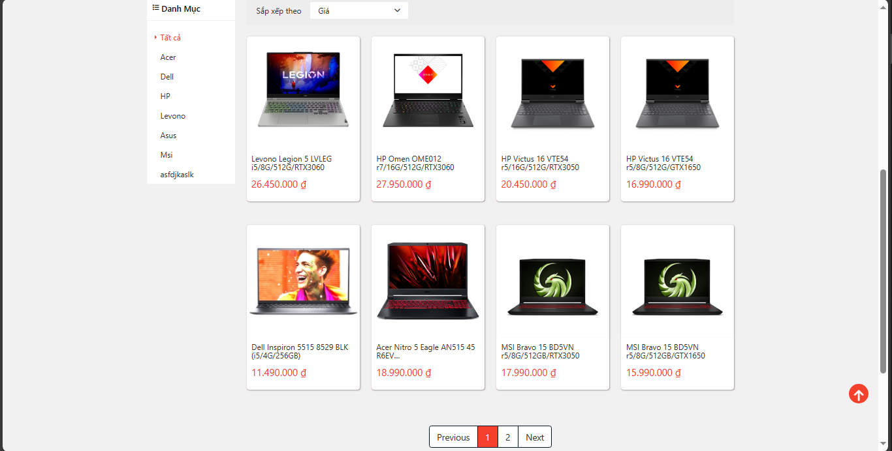
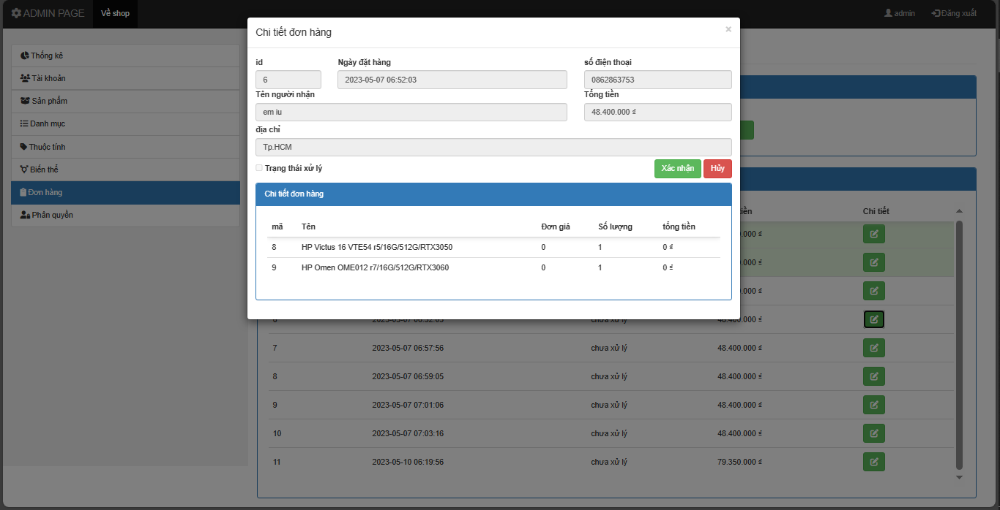

# Portfolio
---
# Skills
## Learned
Language: HTML5, CSS, JavaSript, Java core, C/C++, PHP  
Framework: Bootstrap, NodeJS; ORM,ODM: Hibernate, Morphia, Mongoose
## Learning
Language: Python  
Framework: Flask, Django, Spring boot, ReactJS; ORM, ODM: Sequelize, Django ORM

---
# Projects
## FTP Application

FTP Secure is a unique and secure solution for data transmission between client and server. Built on the Java platform and utilizing the Hibernate framework, this application not only provides a user-friendly interface but also ensures high security.

By employing Socket, the application establishes a robust connection between devices while using symmetric key encryption to safeguard data from unauthorized access. The flexible combination of asymmetric keys ensures that only authenticated partners can connect, thus mitigating security risks effectively.

Through Hibernate, user management becomes both easy and secure, facilitating the efficient maintenance of user information. The integrated file management feature is versatile, supporting convenient upload and download operations while effectively organizing directory structures.

This application excels not only in interacting with databases through Hibernate but also in supporting multiple concurrent connections, enhancing performance and promptly addressing users' multitasking needs. FTP Secure seamlessly blends security, flexibility, and efficiency, making it an excellent choice for safe and effective data transmission.

---
### fast food store management

This application, developed in pure Java with Java Swing, serves as a learning project for object-oriented programming and basic database interactions. It features a simple yet effective interface for managing fast-food store data without relying on frameworks. Key aspects include OOP principles, traditional SQL queries for database interaction, and a user-friendly Java Swing interface. This project is designed to help users get acquainted with OOP and the fundamentals of database connectivity in Java.

 

 

---
### Shopee Clone - E-commerce Website with Bootstrap and PHP

This project is a Shopee-inspired e-commerce website developed for learning purposes. It features a Bootstrap-based frontend for a responsive design and utilizes PHP as the backend language. Key functionalities include product listings, user authentication, and a basic shopping cart system. The project aims to provide hands-on experience in Bootstrap, PHP backend development, and database connectivity. Enjoy building your own Shopee-like platform while honing my web development skills!

 

 

---

© 2024 Nguyen Ngoc Truong Chinh. Powered by Jekyll and the Minimal Theme.

